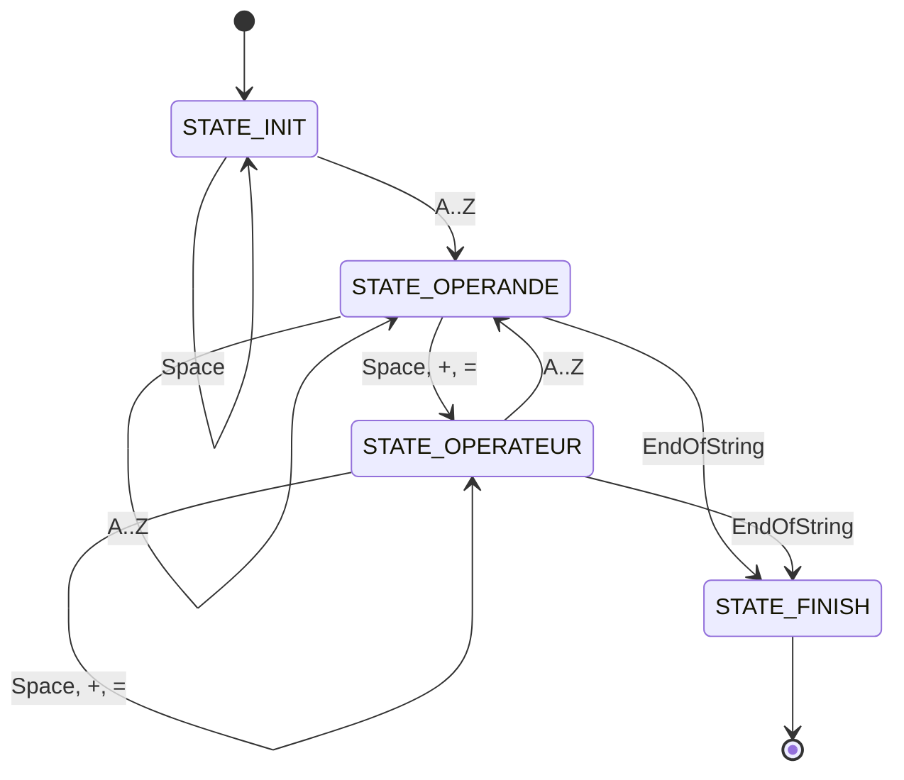
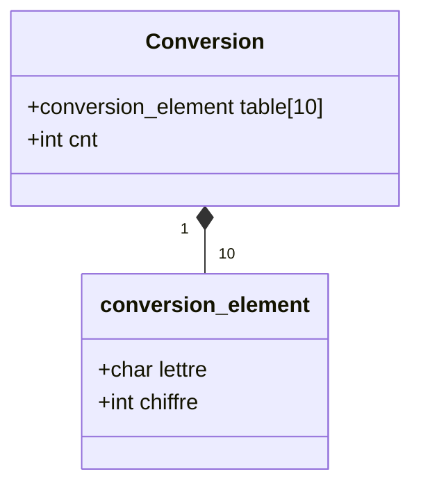

# Cryptarithme

Un cryptarithme est un casse-tête numérique et logique qui consiste en une équation mathématique où les lettres représentent des chiffres à trouver. 

https://fr.wikipedia.org/wiki/Cryptarithme

## Exécution

```bash
$ make
gcc -Wall -Werror -Wextra -o cryptarithme cryptarithme.c operation.c conversions.c combinaisons.c solutions.c

$ ./cryptarithme "SEND + MORE = MONEY"

opération: SEND + MORE = MONEY
solution:  6853 + 0728 = 07581
solution:  9567 + 1085 = 10652
solution:  7429 + 0814 = 08243
solution:  6419 + 0724 = 07143
solution:  7539 + 0815 = 08354
solution:  7649 + 0816 = 08465
solution:  2817 + 0368 = 03185
solution:  8432 + 0914 = 09346
solution:  7531 + 0825 = 08356
solution:  3719 + 0457 = 04176
solution:  8542 + 0915 = 09457
solution:  8324 + 0913 = 09237
solution:  5849 + 0638 = 06487
solution:  3829 + 0458 = 04287
solution:  2819 + 0368 = 03187
solution:  5731 + 0647 = 06378
solution:  7643 + 0826 = 08469
solution:  7534 + 0825 = 08359
solution:  7316 + 0823 = 08139
solution:  6851 + 0738 = 07589
solution:  6524 + 0735 = 07259
solution:  6415 + 0734 = 07149
solution:  5732 + 0647 = 06379
solution:  3821 + 0468 = 04289
solution:  3712 + 0467 = 04179


$ ./test.sh

opération: HUIT + HUIT = SEIZE
solution:  8253 + 8253 = 16506
solution:  9254 + 9254 = 18508
solution:  3258 + 3258 = 06516
solution:  4259 + 4259 = 08518
solution:  1376 + 1376 = 02752
solution:  3128 + 3128 = 06256
solution:  4129 + 4129 = 08258
solution:  4379 + 4379 = 08758
solution:  3248 + 3248 = 06496

opération: UN + UN + NEUF = ONZE
solution:  81 + 81 + 1987 = 2149
^C
```

## Liste des fichiers

- readme.md: ce fichier
- test.sh: série de tests 
- Makefile: compilation
- cryptarithme.c: main()
    - Analyse des arguments
    - Analyse de l'opération
    - Recherche des solutions
- cryptarithme.h: fichier entete
- operation.c
    - state machine analyse opération
    - retourne le tableau des operandes
- solutions.c
    - Recherche des solutions
    - Affiche une solution
- combinaisons.c
    - générateur de combinaisons valides (comme générateurs python)
    - combinaison valide si tous les chiffres différents
- conversions.c
    - Initialisation de la table de conversion d'après les opérandes
    - Affecter une combinaison de chiffres à la table de conversion
    - Convertir un opérande en lettres sous forme de nombre


## State machine: Analyse opérations



Extraire dans l'opération les différents opérandes. L'opération doit être du type:
OPE1 + OPE2 + OPE3 = RESULTAT

Le résultat est dans le tableau char operandes[MAX_OPERANDES][MAX_LEN]:

Indice | Opérande 
---------|----------
 0 | OPE1 
 1 | OPE2 
 2 | OPE3 
 3 | RESULTAT 
 4 | ... 
 5 | ... 

## Structure de données: Conversion



## Exemples

HUIT + HUIT = SEIZE (8253 + 8253 = 16506 et 9254 + 9254 = 18508)

UN + UN + NEUF = ONZE (81 + 81 + 1987 = 2149)

CINQ + CINQ + VINGT = TRENTE (6483 + 6483 + 94851 = 107817)

ZERO + NEUF + NEUF + DOUZE = TRENTE (9206 + 3257 + 3257 + 86592 = 102312)

ZERO + ZERO + ZERO + UN + DOUZE = TREIZE (9506 + 9506 + 9506 + 82 + 76895 = 105495)

ZERO + ZERO + SEPT + SEPT + SEIZE = TRENTE (6904 + 6904 + 7921 + 7921 + 79869 = 109519)

ZERO + UN + TROIS + ONZE + QUINZE = TRENTE (7139 + 68 + 53902 + 9871 + 460871 = 531851)

ZERO + TROIS + TROIS + TROIS + SEPT = SEIZE (4273 + 17356 + 17356 + 17356 + 6201 = 62542)

ZERO + TROIS + TROIS + DOUZE + DOUZE = TRENTE (3496 + 19625 + 19625 + 76034 + 76034 = 194814)

ZERO + QUATRE + QUATRE + ONZE + ONZE = TRENTE (4876 + 130278 + 130278 + 6548 + 6548 = 278528)

UN + UN + QUATRE + DOUZE + DOUZE = TRENTE (59 + 59 + 652801 + 74531 + 74531 = 801981)

UN + DEUX + DEUX + DEUX + DEUX = NEUF (25 + 1326 + 1326 + 1326 + 1326 = 5329)

UN + QUATRE + CINQ + CINQ + QUINZE = TRENTE (50 + 356724 + 8103 + 8103 + 351094 = 724074)

TROIS + TROIS + TROIS + CINQ + SEIZE = TRENTE (14509 + 14509 + 14509 + 7063 + 98028 = 148618)

QUATRE + QUATRE + QUATRE + NEUF + NEUF = TRENTE (172536 + 172536 + 172536 + 9674 + 9674 = 536956)


